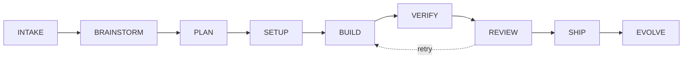
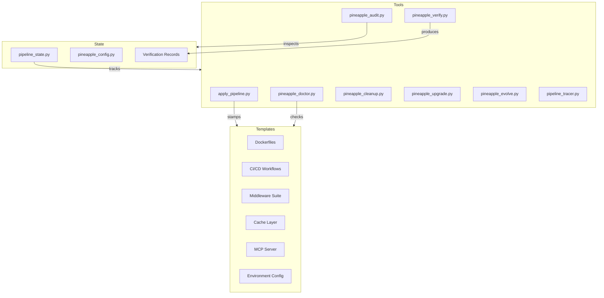

# Pineapple Pipeline

[](https://github.com/Abhishekv87bit/pineapple-pipeline/actions/workflows/ci.yml)
[](LICENSE)
[](https://www.python.org/downloads/)
[](https://docs.pydantic.dev/)

A universal, AI-powered development pipeline that enforces a disciplined 9-stage process from idea intake through production delivery and continuous evolution.



---

## What This Does

Pineapple Pipeline provides a complete framework for shipping AI-enabled applications to production. It defines nine sequential stages -- INTAKE, BRAINSTORM, PLAN, SETUP, BUILD, VERIFY, REVIEW, SHIP, and EVOLVE -- each with explicit entry/exit criteria and enforcement gates that prevent skipping steps. The pipeline state machine tracks every run with unique IDs, timestamps, and an append-only event log.

The project includes a library of 11 production-ready templates covering Docker containerization, CI/CD workflows, middleware (input guardrails, rate limiting, resilience, observability), caching, environment configuration, and MCP server scaffolding. Templates use placeholder substitution so they adapt to any project structure automatically.

Verification is the security-critical stage: a 6-layer verification runner executes unit tests, integration tests, security scans, LLM evaluations, and domain-specific validators, then produces a signed verification record with SHA-256 integrity hashing. Enforcement gates (via hookify rules) physically prevent merging code that lacks a fresh, valid verification record.

---

## Architecture



---

## Built With

| Component | Purpose |
|-----------|---------|
| **Python 3.12** | Core runtime for all tools and templates |
| **Pydantic v2** | Data validation, pipeline state models, configuration schema |
| **pytest** | Test framework for unit, integration, and template validation |
| **GitHub Actions** | CI/CD with lint, test, and commit lint jobs |
| **YAML** | Configuration, CI workflows, commit lint rules |
| **Ruff** | Fast Python linter and formatter |

---

## Getting Started

### Prerequisites

- Python 3.10+ (3.12 recommended)
- Git
- Docker (optional, for container templates)

### Installation

```bash
git clone https://github.com/Abhishekv87bit/pineapple-pipeline.git
cd pineapple-pipeline
pip install -e ".[dev]"
```

### Quick Start

```bash
# Apply the pipeline to any project
python tools/apply_pipeline.py /path/to/your/project --stack fastapi-vite

# Dry run (see what would be created without writing files)
python tools/apply_pipeline.py /path/to/your/project --dry-run

# Run health checks on your environment
python tools/pineapple_doctor.py

# Verify a project (runs all 6 layers)
python tools/pineapple_verify.py /path/to/your/project

# Verify specific layers only
python tools/pineapple_verify.py /path/to/your/project --layers 1,3
```

---

## Project Structure

```
pineapple-pipeline/
  templates/              # 11 production templates
    Dockerfile.fastapi    #   FastAPI container image
    Dockerfile.vite       #   Vite/React container image
    ci.github-actions.yml #   CI/CD workflow
    docker-compose.template.yml
    env.template          #   Environment variable scaffold
    input_guardrails.py   #   67-pattern prompt injection defense
    rate_limiter.py       #   Per-route rate limiting
    resilience.py         #   Circuit breaker + retry + fallback
    observability.py      #   LangFuse tracing + cost tracking
    cache.py              #   Caching layer
    mcp_server.py         #   MCP tool server scaffold
    test_adversarial.py   #   Adversarial prompt test suite
    test_eval_benchmark.py#   LLM evaluation benchmarks
  tools/                  # Pipeline tools
    apply_pipeline.py     #   Template scaffolder
    pineapple_verify.py   #   6-layer verification runner
    pineapple_doctor.py   #   Environment health checker
    pineapple_audit.py    #   Pipeline state auditor
    pineapple_cleanup.py  #   Stale artifact cleaner
    pineapple_upgrade.py  #   Template version upgrader
    pineapple_evolve.py   #   Session learning extractor
    pineapple_config.py   #   Configuration manager
    pipeline_state.py     #   State machine (Pydantic models)
    pipeline_tracer.py    #   Execution tracer
  tests/                  # Test suite
  RUNBOOK.md              # Operational runbook
  THREAT_MODEL.md         # Security threat model
```

---

## Development

```bash
# Install dev dependencies
pip install -e ".[dev]"

# Run tests
pytest -v

# Lint
ruff check .

# Format
ruff format .
```

---

## Documentation

- **[RUNBOOK.md](RUNBOOK.md)** -- Operational runbook covering diagnosis and recovery for every pipeline component
- **[THREAT_MODEL.md](THREAT_MODEL.md)** -- Security threat model with asset inventory, adversary profiles, attack surface analysis, and mitigations
- **[CONTRIBUTING.md](CONTRIBUTING.md)** -- Contribution guidelines
- **[CHANGELOG.md](CHANGELOG.md)** -- Release history

---

## License

This project is licensed under the MIT License. See [LICENSE](LICENSE) for details.
